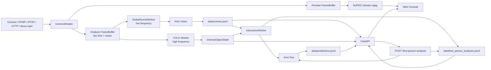

# Interaction Predictor MVP

一个用于第一人称摄像头画面的潜在交互行为预测模块。项目从摄像头、RTMP/RTSP/HTTP 视频流或本机测试视频中获取画面，低频调用 Kimi 多模态模型理解全局场景，高频使用 YOLO 识别画面中央的兴趣物体，再把“环境”和“当前关注物体”融合为第一人称交互预测。

这个仓库当前定位是最小可运行 MVP：便于本机演示、调试接口、验证提示词和后续集成到更大的系统中。

## 项目目标

- 把第一人称摄像头画面转成可存储、可检索的结构化场景文本。
- 持续识别画面中央附近的兴趣物体，避免所有画面都走大模型造成高延迟和高成本。
- 当中心兴趣物稳定停留超过一段时间后，推测“我在当前环境中可能如何与这个物体交互”。
- 提供可视化 Web 控制台，快速测试摄像头切换、实时画面、场景理解、兴趣物识别、预测结果和历史数据。
- 提供一键启动和本机后台部署脚本，方便上传 GitHub 后快速复现。

## 核心思路

系统把同一段视频流先拆成预览帧和分析帧：预览帧优先服务控制台实时画面，分析帧按 `ANALYSIS_FPS_LIMIT` 限流并按 `ANALYSIS_MAX_SIDE` 缩小后再进入推理链路。这样播放画面不会跟着 YOLO、场景理解和大模型调用一起卡顿。

分析侧再拆成两条不同频率的链路：

1. 全局场景链路：每隔 `SCENE_INTERVAL_SEC` 秒取一帧全图，压缩后直接传给 Kimi 多模态模型，得到当前环境、主要事物和场景推测，并写入 `data/scenes.jsonl`。
2. 中心兴趣物链路：用 YOLO 高频检测画面里的物体，优先选择靠近画面中心、面积和置信度合理的目标，抽象为“用户当前视野关注点”。
3. 自动交互预测链路：只有当中心兴趣物在最近窗口内足够稳定，才把最新场景和兴趣物输入大模型，输出前三个第一人称潜在交互行为，并写入 `data/predictions.jsonl`，同时把完整 prompt、原始大模型输出和标准化结果写入 `data/first_person_analyses.jsonl`。
4. 按需第一人称分析链路：通过 `POST /first-person-analysis` 手动触发一次同类分析，也写入同一个独立 JSONL，便于区分自动预测历史和人工测试历史。

提示词的核心问题是：

```text
如果我在这样一个<环境>中，我的视野关注点在一个<object>上，我可能对这个<object>产生的潜在交互行为是什么？
```

## 架构



主要模块：

| 模块 | 作用 |
| --- | --- |
| `interaction_predictor/camera.py` | 摄像头、本机视频、RTMP/RTSP/HTTP 拉流，本机设备检测和浏览器摄像头帧接入 |
| `interaction_predictor/scene_worker.py` | 低频全局场景理解，默认把真实图像传给 Kimi 多模态 |
| `interaction_predictor/yolo_worker.py` | 高频 YOLO 检测，选择中心兴趣物并维护稳定状态 |
| `interaction_predictor/interaction_worker.py` | 融合场景和兴趣物，预测前三个潜在交互行为 |
| `interaction_predictor/prompts.py` | 场景理解和第一人称交互预测提示词 |
| `interaction_predictor/app.py` | FastAPI 服务、API、MJPEG 实时流和 Web UI 托管 |
| `interaction_predictor/web/` | 本地演示控制台 |

## 技术栈

- Python 3.10+
- FastAPI + Uvicorn：本地 API 服务和 Web UI 托管
- OpenCV：摄像头、本地视频和网络视频流读取
- ffmpeg：macOS AVFoundation 摄像头和 RTMP/RTMPS 直播流拉帧
- Ultralytics YOLO：中心兴趣物检测
- Kimi 中国站 API：多模态场景理解和文本交互预测
- Pydantic：结构化数据模型
- 原生 HTML/CSS/JavaScript：无前端构建步骤的演示控制台
- JSONL：MVP 阶段的场景和预测结果持久化

项目也保留了 Ollama provider，方便回退到本地模型做文本链路验证。

## 快速启动

```bash
git clone <your-repo-url>
cd interaction-predictor-mvp
cp .env.example .env
```

编辑 `.env`，至少填入：

```bash
MOONSHOT_API_KEY=你的 Kimi API Key
CAMERA_URL=/tmp/interaction-predictor-demo/demo.mp4
```

启动：

```bash
./scripts/start.sh
```

打开控制台：

```text
http://127.0.0.1:8000/
```

控制台可以直接测试健康检查、实时画面、摄像头检测/切换、最新场景、中心兴趣物、最新预测、第一人称按需分析和历史记录。

## 一键部署

后台部署并自动重启已有实例：

```bash
./scripts/deploy.sh
```

查看日志：

```bash
tail -f runtime/server.log
```

停止服务：

```bash
./scripts/stop.sh
```

默认使用 `nohup` 后台进程，适合本地 MVP 演示。macOS 上也可以用 LaunchAgent 托管：

```bash
USE_LAUNCHD=1 ./scripts/deploy.sh
```

如果项目放在 `Documents`、`Desktop` 等受 macOS 隐私保护的目录，LaunchAgent 或 Python 进程可能需要完整磁盘访问权限。摄像头权限也可能按浏览器、终端或 Python 进程分别授权。

## 常用配置

`.env.example` 提供了默认配置。常用项如下：

```bash
MOONSHOT_API_KEY=replace_with_your_key
LLM_PROVIDER=kimi
KIMI_BASE_URL=https://api.moonshot.cn/v1
KIMI_MODEL=kimi-k2.6
KIMI_VISION_MODEL=kimi-k2.5

CAMERA_URL=rtmp://Mittys-MacBook-Pro.local:1935/live/index
CAMERA_DEMO_VIDEO=/tmp/interaction-predictor-demo/demo.mp4
CAMERA_PROBE_COUNT=6
CAMERA_FPS_LIMIT=30
CAMERA_WIDTH=640
CAMERA_HEIGHT=480
ANALYSIS_FPS_LIMIT=8
ANALYSIS_MAX_SIDE=640
OPENCV_AVFOUNDATION_SKIP_AUTH=0

SCENE_INPUT_MODE=image
SCENE_INTERVAL_SEC=15
STREAM_FPS=20

YOLO_MODEL=yolo11n.pt
YOLO_FPS=5
YOLO_IMAGE_SIZE=416
INTEREST_STABLE_DURATION_SEC=2
INTEREST_STABLE_MATCH_RATIO=0.75
INTEREST_STABLE_MIN_SAMPLES=4
```

手动启动方式：

```bash
python -m venv .venv
source .venv/bin/activate
pip install -e .
export MOONSHOT_API_KEY="你的 Kimi API Key"
python -m interaction_predictor --camera-url rtmp://Mittys-MacBook-Pro.local:1935/live/index
```

回退到本地 Ollama：

```bash
LLM_PROVIDER=ollama \
OLLAMA_BASE_URL=http://office.zhoudians.com:41434 \
OLLAMA_MODEL=qwen3.5:27b \
python -m interaction_predictor --camera-url rtmp://Mittys-MacBook-Pro.local:1935/live/index
```

## 摄像头输入源

支持这些输入：

```text
本机摄像头 index：0、1、2...
macOS AVFoundation：avfoundation:0、avfoundation:1...
浏览器摄像头：前端里选择“浏览器摄像头授权/检测”后出现
HLS/HTTP/RTSP/RTMP：http://example/live/index.m3u8、rtmp://example/live/stream、rtmps://example/live/stream
本机测试视频：/tmp/interaction-predictor-demo/demo.mp4
```

控制台会调用 `GET /camera/sources` 检测本机摄像头和 demo 视频，并可通过 `POST /camera/source` 在线切换，不需要重启服务。页面可直接填写 HLS、HTTP、RTSP、RTMP 或 RTMPS 直播流地址后点击“拉流”，该直播流会作为实时视频输入源进入 YOLO、场景理解和第一人称交互分析链路。页面上的分辨率下拉会随输入源一起提交；后端摄像头会尝试设置 OpenCV/AVFoundation capture resolution，浏览器摄像头会使用 `getUserMedia` 的 `width`/`height` constraints。

HLS/RTMP/RTMPS 源也可以通过环境变量或 API 设置：

```bash
CAMERA_URL=rtmp://Mittys-MacBook-Pro.local:1935/live/index python -m interaction_predictor
```

```text
POST /camera/source {"source":"rtmp://Mittys-MacBook-Pro.local:1935/live/index"}
```

检测到 HLS/HTTP/RTSP/RTMP/RTMPS 输入时，后端会优先使用本机 `ffmpeg` 拉流，把视频帧先写入预览缓冲，再按分析限流和缩放规则写入分析缓冲；未安装 `ffmpeg` 时会回退到 OpenCV 的 `VideoCapture`。如果请求了分辨率，ffmpeg 网络流链路会在输出帧前执行 `scale`，例如页面选择 `640 x 480` 时，16:9 直播流通常会输出 `640 x 360` 的预览帧和分析候选帧，从源头减少后续解码、复制和 YOLO 推理成本。

RTMP 低延迟建议先用这组配置测试：

```bash
CAMERA_FPS_LIMIT=30
STREAM_FPS=20
ANALYSIS_FPS_LIMIT=8
ANALYSIS_MAX_SIDE=640
CAMERA_WIDTH=640
CAMERA_HEIGHT=480
YOLO_IMAGE_SIZE=416
YOLO_FPS=5
```

其中 `CAMERA_FPS_LIMIT` 更接近摄取和预览上限，`STREAM_FPS` 是 MJPEG 输出上限；`ANALYSIS_FPS_LIMIT` 只限制进入 YOLO/场景理解的帧，`ANALYSIS_MAX_SIDE` 只缩放分析帧，不会降低控制台预览帧本身的分辨率。预测链路慢或机器资源紧张时，优先把 `ANALYSIS_FPS_LIMIT` 调到 `5` 左右、把 `ANALYSIS_MAX_SIDE` 调到 `512` 或 `416`。

分辨率 API：

```text
GET /camera/resolution
POST /camera/resolution {"width":1280,"height":720}
POST /camera/resolution {"width":null,"height":null}
```

如果摄像头不支持请求的分辨率，实际画面尺寸以 `camera.status.actual_resolution` 为准。

macOS 上如果 `GET /camera/sources` 只看到测试视频，通常是当前 Python/终端进程没有摄像头权限，或者系统没有暴露可读的本机摄像头设备。如果 Photo Booth 可用但页面持续 offline，优先在前端使用“浏览器摄像头授权/检测”。浏览器会单独请求摄像头权限，拿到帧后通过 `/camera/browser-frame` 送回本地后端。

切换摄像头源时，当前帧缓存、YOLO 兴趣物状态、场景历史和预测历史会被清空，避免旧输入源的数据污染新输入源。

## API

服务默认运行在 `http://0.0.0.0:8000`。

```text
GET /
GET /health
GET /camera/sources
GET /camera/source
POST /camera/source {"source":"0","width":1280,"height":720}
POST /camera/source {"source":"rtmp://Mittys-MacBook-Pro.local:1935/live/index"}
GET /camera/resolution
POST /camera/resolution {"width":1280,"height":720}
POST /camera/browser-frame
GET /latest-scene
GET /latest-interest-object
GET /latest-prediction
GET /latest-first-person-analysis
POST /first-person-analysis?require_stable=true&include_prompt=true&persist=true
GET /history/scenes?limit=20
GET /history/predictions?limit=20
GET /history/first-person-analyses?limit=20
GET /snapshot
GET /stream.mjpg
```

前端主画面使用 `GET /stream.mjpg` 持续显示 MJPEG 实时流，读取的是独立预览缓冲；MJPEG 编码会放到独立预览线程池执行，和 YOLO、场景理解、大模型推理、历史查询刷新解耦。`GET /snapshot` 也读取预览缓冲，只用于单帧调试。

`GET /latest-first-person-analysis` 读取 `data/first_person_analyses.jsonl` 中最近一次第一人称分析；自动 worker 和 `POST /first-person-analysis` 都会写入这个文件。`POST /first-person-analysis` 会按需调用大模型，使用最新场景和当前稳定中心兴趣物，返回实际发送给大模型的 `prompt`、`raw_llm_output` 和标准化后的 `prediction`。设置 `persist=true` 时会写入独立的第一人称分析历史。

## 输出文件

默认写入：

```text
data/scenes.jsonl
data/predictions.jsonl
data/first_person_analyses.jsonl
```

这些文件用于 MVP 调试和回放分析，默认不建议提交到仓库。

## 项目结构

```text
interaction_predictor/
  app.py                 FastAPI API、Web UI、实时流
  camera.py              视频源读取和设备检测
  config.py              环境变量和启动配置
  interaction_worker.py  第一人称潜在交互预测
  kimi.py                Kimi API client
  ollama.py              Ollama API client
  prompts.py             大模型提示词
  scene_worker.py        全局场景理解
  storage.py             JSONL 存储
  web/                   本地演示控制台
  yolo_worker.py         YOLO 中心兴趣物检测
scripts/
  start.sh               前台启动
  deploy.sh              后台部署或 LaunchAgent 部署
  stop.sh                停止后台服务
```

## 当前 MVP 边界

- 默认用 JSONL 做持久化，没有引入数据库。
- YOLO 只做兴趣物检测，不做全局场景理解。
- 第一人称预测是概率性推测，不代表真实用户意图。
- 多摄像头在 macOS 上可能受到系统权限、浏览器权限和 OpenCV AVFoundation 后端限制。
